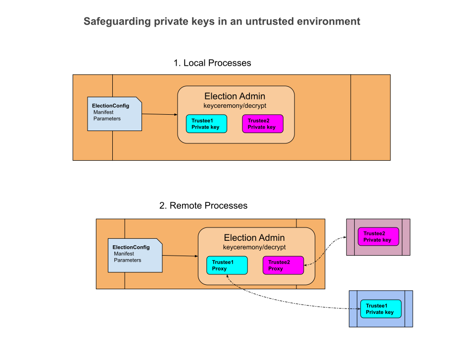

# Workflow and Command Line Programs

last update 7/24/2023

<!-- TOC -->
* [Workflow and Command Line Programs](#workflow-and-command-line-programs)
  * [Election workflow](#election-workflow)
  * [Run Trusted KeyCeremony](#run-trusted-keyceremony)
  * [Run Batch Encryption](#run-batch-encryption)
  * [Run Accumulate Tally](#run-accumulate-tally)
  * [Run Trusted Tally Decryption](#run-trusted-tally-decryption)
  * [Run Trusted Ballot Decryption](#run-trusted-ballot-decryption)
  * [Run Verifier](#run-verifier)
  * [Remote Processes](#remote-processes)
    * [Make KeyStore](#make-keystore)
<!-- TOC -->

## Election workflow


1. **Create a Manifest record** 
   1. Generating a real Manifest by election officials is outside the scope of this library. That is to say,
      you must figure out what that looks like yourself, and use it as input to the library.
   2. Create a manifest in code with the _electionguard.ballot.Manifest_ classes, and write it out
          with a Publisher. 
   3. Create a fake manifest for testing with the _electionguard.input.RunCreateTestManifest_ CLI.
   4. Convert an existing manifest between JSON and Proto with the _electionguard.cli.RunConvertManifest_ CLI.
      The type (JSON or Proto) of Manifest is used for the rest of the election record.

2. **Create an ElectionConfig record**.
   1. Create an ElectionConfig from a Manifest and input parameters using _electionguard.cli.RunCreateElectionConfig_ CLI.

3. **Run the KeyCeremony**. 

   1. _electionguard.keyceremony.RunTrustedKeyCeremony_ is a CLI that will run the entire key ceremony locally in a
       single process. See _electionguard.keyceremony.RunKeyCeremonyTest_ as an example.

   2. To run a keyceremony with remote guardians, using the webapps CLI:

        1. In _webapps/keyceremonytrustees_, start up _webapps.electionguard.KeyCeremonyRemoteTrustee_, and specify the
           directory to write the private trustee files, using the command line argument:

           `-trusteeDir <trustee directory>`

        2. In _webapps/keyceremony_, run _webapps.electionguard.keyceremony.RunRemoteKeyCeremony_ CLI (see
           RunRemoteKeyCeremonyTest as an example of the inputs needed).

4. **Create test input plaintext ballots**
   1._electionguard.workflow.GenerateFakeBallots_ generates random test ballots.

5. **Batch Encryption**. 
    1. _electionguard.encrypt.RunBatchEncryption_ is a CLI that reads an ElectionInitialized record and input plaintext
       ballots, encrypts the ballots and writes out EncryptedBallot records. If any input plaintext ballot fails validation,
       it is annotated and written to a separate directory, and not encrypted.
    2. _electionguard.encrypt.AddEncryptedBallot_ is a class that your program calls to encrypt plaintext ballots
       and add them to the election record.
   3. In jvmMain, _electionguard.cli.ExampleEncryption_ is an example of using AddEncryptedBallot.

6. **Accumulate Tally**.
    1. _electionguard.tally.RunAccumulateTally_ is a CLI that reads an ElectionInitialized record and EncryptedBallot
       records, sums the votes in the encrypted ballots and writes out a _EncryptedTally_ record.

7. **Decryption**.
    1. _electionguard.decrypt.RunTrustedTallyDecryption_ is a CLI for testing, that will run locally in a single
       process, reads an EncryptedTally record and local DecryptingTrustee records, decrypts the tally and writes out 
       a _DecryptedTallyOrBallot_ record for the tally.
    2. _electionguard.decrypt.RunTrustedBallotDecryption_ is a CLI for testing, that will run locally in a single
       process, that reads a spoiled ballot record and local DecryptingTrustee records, decrypts the ballot and writes out a
       _DecryptedTallyOrBallot_ record for the spoiled ballot.

    3. To run a decryption using the webapps CLI:

        1. In _webapps/decryptingtrustee_, start up _webapps.electionguard.Application_

        2. In _webapps/decryption_, run _webapps.electionguard.decrypt.RunRemoteTallyDecryption_ CLI.

        3. See _webapps.electionguard.decrypt.RunRemoteWorkflow_ in the tests, as an example.

8. **Verify**. 
    1. _electionguard.verify.VerifyElectionRecord_ is a CLI that reads an election record and verifies it.

9. **Complete test Workflow**.
    1. A complete test workflow can be run from electionguard.workflow.TestWorkflow.


## Run Trusted KeyCeremony

This has access to all the trustees, so is only used for testing, or in a use case of trust.

````
Usage: RunTrustedKeyCeremony options_list
Options: 
    --inputDir, -in -> Directory containing input ElectionConfig record { String }
    --electionManifest, -manifest -> Manifest file or directory (json or protobuf) { String }
    --nguardians, -nguardians -> number of guardians { Int }
    --quorum, -quorum -> quorum size { Int }
    --trusteeDir, -trustees -> Directory to write private trustees (always required) { String }
    --outputDir, -out -> Directory to write output ElectionInitialized record (always required) { String }
    --createdBy, -createdBy -> who created { String }
    --help, -h -> Usage info 
````

As input, either specify the input directory that contains __electionConfig.protobuf__ file, OR the election manifest,
nguardians and quorum.

The _electionManifest_ may name

* a json or protobuf file containing the manifest
* a directory containing __manifest.protobuf__ or __manifest.json__

input:

* _inputDir_/electionConfig.protobuf
* _electionManifest_/manifest.protobuf
* _electionManifest_/manifest.json
* _electionManifest_ is a file containing the manifest (json or protobuf)

output:

* _trusteeDir_/decryptingTrustee-_guardianId_.protobuf
* _outputDir_/electionInitialized.protobuf

## Run Batch Encryption

````
Usage: RunBatchEncryption options_list
Options: 
    --inputDir, -in -> Directory containing input ElectionInitialized.protobuf file (always required) { String }
    --ballotDir, -ballots -> Directory to read Plaintext ballots from (always required) { String }
    --outputDir, -out -> Directory to write output election record (always required) { String }
    --invalidDir, -invalid -> Directory to write invalid input ballots to { String }
    --fixedNonces, -fixed [false] -> Encrypt with fixed nonces and timestamp 
    --check, -check [None] -> Check encryption { Value should be one of [None, Verify, EncryptTwice] }
    --nthreads, -nthreads [11] -> Number of parallel threads to use { Int }
    --createdBy, -createdBy -> who created { String }
    --help, -h -> Usage info 
````

input:

* _inputDir_/electionInitialized.protobuf
* _ballotDir_/plaintextBallots.protobuf

output:

* _outputDir_/encryptedBallots.protobuf
* _invalidDir_/plaintextBallots.protobuf

## Run Accumulate Tally

````
Usage: RunAccumulateTally options_list
Options: 
    --inputDir, -in -> Directory containing input ElectionInitialized record and encrypted ballots (always required) { String }
    --outputDir, -out -> Directory to write output election record (always required) { String }
    --name, -name -> Name of accumulation { String }
    --createdBy, -createdBy -> who created { String }
    --help, -h -> Usage info 
````

Only CAST ballots are tallied.

input:

* _inputDir_/electionInitialized.protobuf
* _inputDir_/encryptedBallots.protobuf

output:

* _outputDir_/tallyResult.protobuf
* 

## Run Trusted Tally Decryption

This has access to all the trustees, so is only used for testing, or in a use case of trust.

````
Usage: RunTrustedTallyDecryption options_list
Options: 
    --inputDir, -in -> Directory containing input election record (always required) { String }
    --trusteeDir, -trustees -> Directory to read private trustees (always required) { String }
    --outputDir, -out -> Directory to write output election record (always required) { String }
    --createdBy, -createdBy -> who created { String }
    --npresent, -npresent -> number of guardians present { Int }
    --help, -h -> Usage info 
````

input:

* _inputDir_/tallyResult.protobuf

output:

* _outputDir_/decryptionResult.protobuf

## Run Trusted Ballot Decryption

This has access to all the trustees, so is only used for testing, or in a use case of trust.

````
Usage: RunTrustedBallotDecryption options_list
Options: 
    --inputDir, -in -> Directory containing input election record (always required) { String }
    --trusteeDir, -trustees -> Directory to read private trustees (always required) { String }
    --outputDir, -out -> Directory to write output election record (always required) { String }
    --decryptSpoiledList, -spoiled -> decrypt spoiled ballots { String }
    --nthreads, -nthreads -> Number of parallel threads to use { Int }
    --help, -h -> Usage info 
````

The decryptSpoiledList may be:

1. a comma-delimited (no spaces) list of ballot Ids referencing encryptedBallots.protobuf
2. a fully-qualified filename of a text file containing ballot Ids (one per line) referencing encryptedBallots.protobuf
3. "All" -> decrypt all the ballots in encryptedBallots.protobuf
4. omitted -> decrypt the ballots in encryptedBallots.protobuf that have been marked SPOILED.

input:

* _inputDir_/tallyResult.protobuf
* _inputDir_/encryptedBallots.protobuf

output:

* _outputDir_/spoiledBallotTallies.protobuf

## Run Verifier

```` 
Usage: RunVerifier options_list
Options: 
    --inputDir, -in -> Directory containing input election record (always required) { String }
    --nthreads, -nthreads -> Number of parallel threads to use { Int }
    --showTime, -time [false] -> Show timing 
    --help, -h -> Usage info 
````

input:

* _inputDir_/decryptionResult.protobuf
* _inputDir_/spoiledBallotTallies.protobuf (optional)

output:

* stdout

## Remote Processes



### Make KeyStore

To use HTTPS between remote processes, we need a digital certificate. You may supply your own keystore, or use the
__MakeKeystore__ CLI (in keyceremonytrustee test directory).
This will generate a self-signed certificate and write it to a JKS keystore, to be used in the webapps.
The certificate _alias_ = "electionguard" and _domains_ = listOf("127.0.0.1", "0.0.0.0", "localhost").

````
Usage: MakeKeyStore options_list
Options: 
Options: 
    --keystorePassword, -kpwd -> password for the entire keystore (always required) { String }
    --electionguardPassword, -epwd -> password for the electionguard certificate entry (always required) { String }
    --sslKeyStore, -keystore -> write the keystore file to this path, default webapps/keystore.jks { String }
    --help, -h -> Usage info 
````

Example

````
java -classpath <classpath> webapps.electionguard.MakeKeystoreKt -kpwd keystorePassword -epwd egPassword
````

output:

````
MakeKeyStore
 keystorePassword = 'ksPassword' electionguardPassword = 'egPassword'
 write to path = 'webapps/keystore.jks'
````