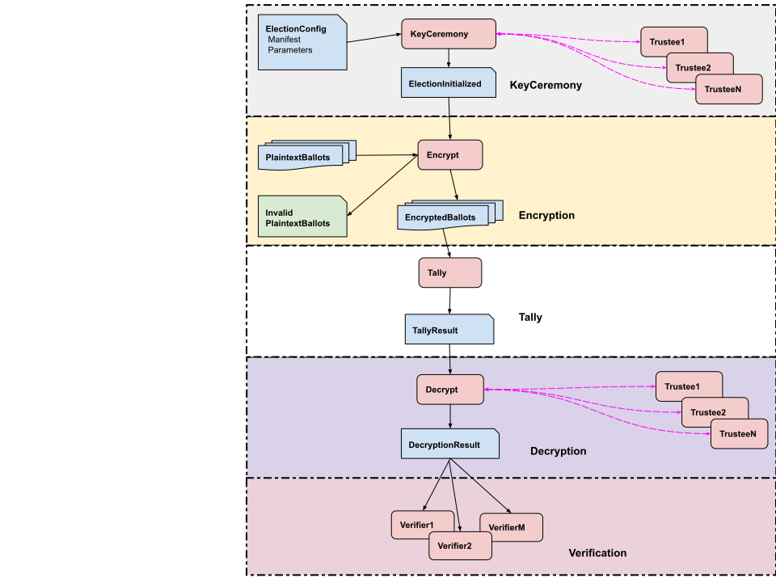

# Workflow and Command Line Programs (Under Construction)

last update 9/10/2023

<!-- TOC -->
* [Workflow and Command Line Programs (Under Construction)](#workflow-and-command-line-programs-under-construction)
  * [Election workflow overview](#election-workflow-overview)
  * [Make ekglib fatJar](#make-ekglib-fatjar)
  * [Create an Election Configuration](#create-an-election-configuration)
  * [Run trusted KeyCeremony](#run-trusted-keyceremony)
  * [Run Batch Encryption](#run-batch-encryption)
  * [Run Accumulate Tally](#run-accumulate-tally)
  * [Run trusted Tally Decryption](#run-trusted-tally-decryption)
  * [Run trusted Ballot Decryption](#run-trusted-ballot-decryption)
  * [Run Verifier](#run-verifier)
<!-- TOC -->

## Election workflow overview



1. **Create a Manifest record** 
   1. Generating a real Manifest by election officials is outside the scope of this library. That is to say,
      you must figure out what that looks like yourself, and use it as input to the library.
   2. Create a manifest in code with the _electionguard.ballot.Manifest_ classes, and write it out
          with a Publisher. 
   3. Create a fake manifest for testing with the _electionguard.input.createTestManifest_ test program.
   4. Use an existing fake manifest for testing in _egklib/src/commonTest/data/startManifestJson/manifest.json_ or
      _egklib/src/commonTest/data/startManifestProto/manifest.protobuf_

2. **Create an ElectionConfig record**.
   1. Create an ElectionConfig from a Manifest and input parameters using [_RunCreateElectionConfig_ CLI](#create-an-election-configuration)

3. **Run the KeyCeremony**. 
   1. Create an ElectionInitialized from an ElectionConfig and input parameters using [_RunTrustedKeyCeremony_ CLI](#run-trusted-keyceremony)
   2. To run a keyceremony with remote guardians, see the webapps CLI.

4. **Create test input plaintext ballots**.
   1. _electionguard.workflow.GenerateFakeBallots_ generates random test ballots.
   2. Use existing fake ballots for testing in _egklib/src/commonTest/data/fakeBallots

5. **Batch Encryption**. 
   1. _electionguard.encrypt.RunBatchEncryption_ is a CLI that reads an ElectionInitialized record and input plaintext
       ballots, encrypts the ballots and writes out EncryptedBallot records. If any input plaintext ballot fails validation,
       it is annotated and written to a separate directory, and not encrypted.
   2. _electionguard.encrypt.AddEncryptedBallot_ is a class that your program calls to encrypt plaintext ballots
       and add them to the election record.
   3. In jvmMain, _electionguard.cli.ExampleEncryption_ is an example of using AddEncryptedBallot.
   4. To run encryption with the Encryption server, see the webapps CLI. This allows you to run the encryption on a 
      different machine than where ballots are generated, and/or to call from a non-JVM program.

6. **Accumulate Tally**.
    1. _electionguard.tally.RunAccumulateTally_ is a CLI that reads an ElectionInitialized record and EncryptedBallot
       records, sums the votes in the encrypted ballots and writes out a _EncryptedTally_ record.

7. **Decryption**.
    1. _electionguard.decrypt.RunTrustedTallyDecryption_ is a CLI for testing, that will run locally in a single
       process, reads an EncryptedTally record and local DecryptingTrustee records, decrypts the tally and writes out 
       a _DecryptedTallyOrBallot_ record for the tally.
    2. _electionguard.decrypt.RunTrustedBallotDecryption_ is a CLI for testing, that will run locally in a single
       process, that reads a spoiled ballot record and local DecryptingTrustee records, decrypts the ballot and writes out a
       _DecryptedTallyOrBallot_ record for the spoiled ballot.
    3. To run decryption with remote guardians, see the webapps CLI.

8. **Verify**. 
    1. _electionguard.verify.VerifyElectionRecord_ is a CLI that reads an election record and verifies it.

9. **Complete test Workflow**.
    1. A complete test workflow can be run from electionguard.workflow.TestWorkflow.

## Make ekglib fatJar

For classpath simplicity, the examples below use the ekglib fatJar.


## Create an Election Configuration

````
Usage: RunCreateElectionConfig options_list
Options: 
    --electionManifest, -manifest -> Manifest file or directory (json or protobuf) (always required) { String }
    --nguardians, -nguardians -> number of guardians (always required) { Int }
    --quorum, -quorum -> quorum size (always required) { Int }
    --outputDir, -out -> Directory to write output ElectionInitialized record (always required) { String }
    --createdBy, -createdBy [RunCreateElectionConfigurationy] -> who created { String }
    --baux0, -device [device] -> device information, used for B_aux,0 from eq 58-60 { String }
    --chainCodes, -chainCodes [false] -> chain confirmation codes 
    --help, -h -> Usage info 

````

Example:

````
/usr/lib/jvm/jdk-19/bin/java \
  -Dfile.encoding=UTF-8 -Dsun.stdout.encoding=UTF-8 -Dsun.stderr.encoding=UTF-8 \
  -classpath egklib/build/libs/egklib-all.jar \
  electionguard.cli.RunCreateElectionConfig \
    -manifest egklib/src/commonTest/data/startManifestJson \
    -nguardians 3 \
    -quorum 3 \
    -out testOut/cliWorkflow/config \
    --baux0 device42 \
    --chainCodes
````

## Run trusted KeyCeremony

This has access to all the trustees, so is only used for testing, or in a use case of trust. 
Otherwise, use the remote keyceremony webapps.

````
Usage: RunTrustedKeyCeremony options_list
Options: 
    --inputDir, -in -> Directory containing input election record (always required) { String }
    --trusteeDir, -trustees -> Directory to write private trustees (always required) { String }
    --outputDir, -out -> Directory to write output ElectionInitialized record (always required) { String }
    --createdBy, -createdBy [RunTrustedKeyCeremony] -> who created { String }
    --help, -h -> Usage info 
````

Example:

````
/usr/lib/jvm/jdk-19/bin/java \
  -classpath egklib/build/libs/egklib-all.jar \
  electionguard.cli.RunTrustedKeyCeremony \
    -in testOut/cliWorkflow/config \
    -trustees testOut/cliWorkflow/keyceremony/trustees \
    -out testOut/cliWorkflow/keyceremony 
````

## Run Batch Encryption

````
Usage: RunBatchEncryption options_list
Options: 
    --inputDir, -in -> Directory containing input election record (always required) { String }
    --ballotDir, -ballots -> Directory to read Plaintext ballots from (always required) { String }
    --outputDir, -out -> Directory to write output election record (always required) { String }
    --invalidDir, -invalid -> Directory to write invalid input ballots to { String }
    --check, -check [None] -> Check encryption { Value should be one of [none, verify, encrypttwice, decryptnonce] }
    --nthreads, -nthreads [11] -> Number of parallel threads to use { Int }
    --createdBy, -createdBy -> who created { String }
    --device, -device -> voting device information (always required) { String }
    --help, -h -> Usage info 
````

Example:

````
/usr/lib/jvm/jdk-19/bin/java \
  -classpath egklib/build/libs/egklib-all.jar \
  electionguard.cli.RunBatchEncryption \
    -in testOut/cliWorkflow/keyceremony \
    -ballots egklib/src/commonTest/data/fakeBallots/json \
    -out testOut/cliWorkflow/electionRecord \
    -device device42
````

output:

* outputDir/encrypted_ballots/device
* outputDir/private/invalid_ballots/

## Run Accumulate Tally

````
Usage: RunAccumulateTally options_list
Options: 
    --inputDir, -in -> Directory containing input ElectionInitialized record and encrypted ballots (always required) { String }
    --outputDir, -out -> Directory to write output election record (always required) { String }
    --name, -name -> Name of tally { String }
    --createdBy, -createdBy -> who created { String }
    --help, -h -> Usage info 
````

Example:

````
/usr/lib/jvm/jdk-19/bin/java \
  -classpath egklib/build/libs/egklib-all.jar \
  electionguard.cli.RunAccumulateTally \
    -in testOut/cliWorkflow/electionRecord \
    -out testOut/cliWorkflow/electionRecord 
````

output:

* outputDir/encrypted_tally.(json|protobuf)

Note that at this point in the cliWorkflow example, we are both reading from and writing to the electionRecord. A
production workflow may be significantly different.

## Run trusted Tally Decryption

This has access to all the trustees, so is only used for testing, or in a use case of trust.
Otherwise, use the remote decryption webapps.

````
Usage: RunTrustedTallyDecryption options_list
Options: 
    --inputDir, -in -> Directory containing input election record (always required) { String }
    --trusteeDir, -trustees -> Directory to read private trustees (always required) { String }
    --outputDir, -out -> Directory to write output election record (always required) { String }
    --createdBy, -createdBy -> who created { String }
    --npresent, -npresent -> number of guardians present { Int }
    --help, -h -> Usage info 
````

Example:

````
/usr/lib/jvm/jdk-19/bin/java \
  -classpath egklib/build/libs/egklib-all.jar \
  electionguard.cli.RunTrustedTallyDecryption \
    -in testOut/cliWorkflow/electionRecord \
    -trustees testOut/cliWorkflow/keyceremony/trustees \
    -out testOut/cliWorkflow/electionRecord 
````

output:
* outputDir/tally.(json|protobuf)

## Run trusted Ballot Decryption

This has access to all the trustees, so is only used for testing, or in a use case of trust.
Otherwise, use the remote decryption webapps.

````
Usage: RunTrustedBallotDecryption options_list
Options: 
    --inputDir, -in -> Directory containing input election record (always required) { String }
    --trusteeDir, -trustees -> Directory to read private trustees (always required) { String }
    --outputDir, -out -> Directory to write output election record (always required) { String }
    --decryptChallengedList, -challenged -> decrypt challenged ballots { String }
    --nthreads, -nthreads -> Number of parallel threads to use { Int }
    --help, -h -> Usage info 
````

The decryptSpoiledList may be:

1. a comma-delimited (no spaces) list of ballot Ids referencing encryptedBallots.protobuf
2. a fully-qualified filename of a text file containing ballot Ids (one per line) referencing encryptedBallots.protobuf
3. "All" -> decrypt all the ballots in encryptedBallots.protobuf
4. omitted -> decrypt the ballots in encryptedBallots.protobuf that have been marked SPOILED.

Example:

````
/usr/lib/jvm/jdk-19/bin/java \
  -classpath egklib/build/libs/egklib-all.jar \
  electionguard.cli.RunTrustedBallotDecryption \
    -in testOut/cliWorkflow/electionRecord \
    -trustees testOut/cliWorkflow/keyceremony/trustees \
    -challenged All \
    -out testOut/cliWorkflow/electionRecord 
````

output:

* outputDir/challenged_ballots/

## Run Verifier

```` 
Usage: RunVerifier options_list
Options: 
    --inputDir, -in -> Directory containing input election record (always required) { String }
    --nthreads, -nthreads -> Number of parallel threads to use { Int }
    --showTime, -time [false] -> Show timing 
    --help, -h -> Usage info 
````

Example:

````
/usr/lib/jvm/jdk-19/bin/java \
  -classpath egklib/build/libs/egklib-all.jar \
  electionguard.cli.RunVerifier \
    -in testOut/cliWorkflow/electionRecord \
    -nthreads 10 \
    --showTime
````
